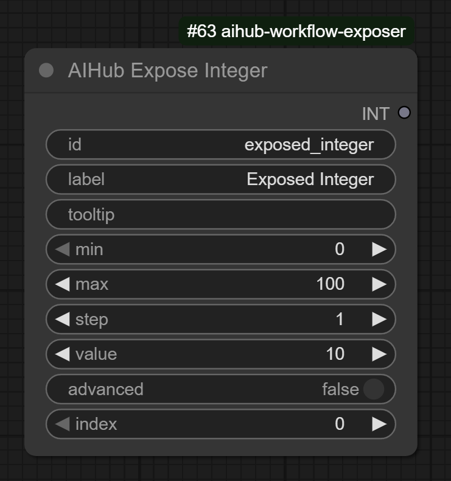
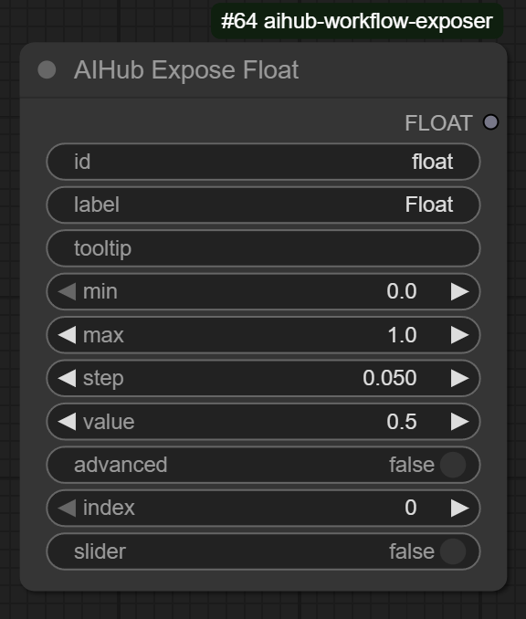
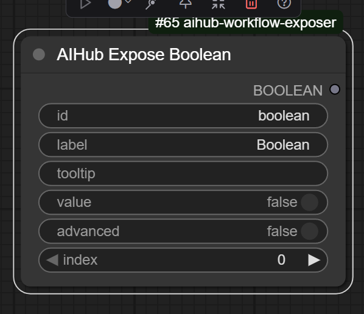

# ComfyUI-aihub-workflow-exposer
Custom nodes for ComfyUI in order to expose AI workflows to external applications (particularly image, video and audio editors) so workflows can be integrated as plugins

## Reasoning

These custom nodes were created in order to build upon a simpler way to utilize workflows from within other applications, by having "exposes", representing data which is exposed from other applications, be so an image editor, video editor or audio editor which exposes a piece of data to a workflow, the workflow is then executed by the application.

Developing exposed workflows, checkpoints and loras, is meant for advanced users; as for the purpose of this project is to enable these other applications plugins so that AI can be taught to people with less professional expertise and without access to powerful machines.

To use these custom nodes and the underlying server that extends comfyUI is highly advanced.

## Set-up basics

This custom nodes has no requeriments, because it uses what comfyUI internally uses; so copying and pasting within the custom_nodes directory should suffice.

You need the following folders within ComfyUI directory.

`ComfyUI/aihub/loras`
`ComfyUI/aihub/models`
`ComfyUI/aihub/workflows`

## Add a lora

In order for a client to have access to a lora, it needs to be configured via a lora file, this is merely a json format file with the following information

Example file:

```json
{
    "id": "faces",
    "file": "faces.safetensors",
    "context": "image",
    "limit_to_family": "sdxl",
    "limit_to_group": "fancy_animal_model",
    "name": "Faces",
    "description": "High quality cute faces for creatures and animals",
}
```

 - id [required]: an unique identifier for the lora, preferrably should match the filename, use alphanumeric only _ and - also allowed
 - file [required]: this represents the safetensors lora file in the `ComfyUI/models/loras` directory
 - context [required]: the context that the lora applies to, image, video, text, 3d, etc... an arbitrary string is expected
 - limit_to_family [required]: limits the lora to an arbitrary string that represents a family for the model, families should be model types, for example, sdxl, flux, qwen, etc...
 - limit_to_group [optional]: limits the lora to an arbitrary group for the model, models can be grouped because they can have different versions, so it should be the name of the model without a version in it, a generic tag
 - limit_to_model [optional]: limits the lora to a specific model id
 - use_loader_model_only [optional]: this represents whether the Lora should affect the clip or not, basically by using the LoaderModelOnly class to load the lora without affecting the clip
 - description [required]: a description for the lora

You can add an image in the same directory with the id as filename, and ending in .png (representing a png image) to make that be the lora image to add as visual aid to the effect that it applies

## Add a model

In order for a client to have access to a model, it needs to be configured via a model file, a json format file with the following information

Example file:

```json
{
    "id": "fancy_animal_model_v10",
    "name": "Fancy Animal Model",
    "file": "fancyAnimalModel.safetensors",
    "family": "sdxl",
    "group": "fancy_animal_model",
    "vae_file": "sdxl_vae.safetensors",
    "description": "A high-quality model for generating images of animals and creatures with intricate details and vibrant colors. Ideal for fantasy art, wildlife illustrations, and imaginative creature designs.",
    "context": "image",
    "is_diffusion_model": false,
    "default_cfg": 3.0,
    "default_steps": 20,
    "default_scheduler": "karras",
    "default_sampler": "dmpp_sde"
}
```

 - id [required]: An unique identifier for the model, preferrably should match the filename, use alphanumeric only _ and - also allowed
 - context [required]: the context that the model applies to, image, video, text, 3d, etc... an arbitrary string is expected
 - file [required]: this represents the safetensors checkpoints file in the `ComfyUI/models/checkpoints` directory or the `ComfyUI/models/diffusion_models` directory
 - family [required]: the family of the model, families should be model types, for example, sdxl, flux, qwen, etc...
 - description [required]: a description for the model
 - group [optional]: The group that the model belongs, should likely be the name of the model without its version
 - vae_file [optional]: If the checkpoint does not contain its own vae, specify the vae file here, it searches at `ComfyUI/models/vae`
 - clip_file [optional]: If the checkpoint does not contain its own clip, specify the clip file here, it searches at `ComfyUI/models/text_encoders`
 - clip_type [optional]: If the checkpoint does not contain its own clip, specify the clip type here, check the LoadClip node to see what the options are, but when adapting a workflow you should see the type there
 - is_diffusion_model [optional]: makes use of the UNETLoader which loads models from `ComfyUI/models/diffusion_models` directory instead of a checkpoint
 - default_cfg [required]: the default cfg for the model
 - default_steps [required]: the default steps for the model
 - default_scheduler [required]: the default scheduler for the model
 - default_sampler [required]: the default sampler for the model

## Adapt a workflow

First any workflow to be adapted requires a AIHubWorkflowController this merely specifies the id of the workflow as well as other useful data about the workflow.

Secondly you need to add as many AIHubExpose nodes as you require to expose data from the client, there are many different types of AIHubExpose nodes for different usages and connect them with your workflow, there are many fields in the expose nodes and they will be explained later; note that you may find more expose nodes when using ComfyUI search functionality but not all has been implemented.

### AIHub Workflow Controller

The workflow controller should exist in each workflow that is exposed, and represents key data about that workflow and how it is to be used.


 - id: Represents the id of the workflow which should be unique among all workflows
 - label: A human readable label to show to the user
 - description: The description to give to the user
 - category: an arbitrary category to place the workflow at
 - context: the context for the workflow
 - project_type [coming soon]: allows to create aihub projects, this represents the type of the project, if a project type is specified the workflow only works with that project type; the advantage of a project is that it can store unique project files that subsequent workflows can later request, this is specially useful, for example, in step by step video generation; in LTXV for example, latent files need to be stored in order to be worked upon further, since working with images is not reasonable; within a project a latent file can be stored once specified.
 - project_type_init [coming soon]: a boolean that allows to specify that the workflow should "start" a new project of the given type, once that is done the project specific workflows are enabled.

### AIHub Expose Integer

The integer expose provides a single integer



 - id: Represents the id of the field which should be unique among all other fields in the same workflow
 - label: A human readable label to show to the user
 - tooltip: A tooltip about this and what it represents
 - min: The minimum value for that integer
 - max: The maximum value for that integer
 - step: The step the integer takes
 - value: The default value for that integer (also the current value)
 - advanced: Whether it represents an advanced option
 - index: Normally it is at the discretion of the client to figure how to sort the fields, use this to specify a specific ordering

### AIHub Expose Float



 - id: Represents the id of the field which should be unique among all other fields in the same workflow
 - label: A human readable label to show to the user
 - tooltip: A tooltip about this and what it represents
 - min: The minimum value for that floating point
 - max: The maximum value for that floating point
 - step: The step the floating point takes
 - value: The default value for that floating point (also the current value)
 - advanced: Whether it represents an advanced option
 - index: Normally it is at the discretion of the client to figure how to sort the fields, use this to specify a specific ordering

### AIHub Expose Boolean



 - id: Represents the id of the field which should be unique among all other fields in the same workflow
 - label: A human readable label to show to the user
 - tooltip: A tooltip about this and what it represents
 - value: The default value for that boolean (also the current value)
 - advanced: Whether it represents an advanced option
 - index: Normally it is at the discretion of the client to figure how to sort the fields, use this to specify a specific ordering

### AIHub Expose Seed

### AIHub Expose Steps

### AIHub Expose Sampler

### AIHub Expose Cfg

### AIHub Expose Scheduler

### AIHub Expose Image

### AIHub Expose Model

### AIHub Action New Image

### AIHub Action New Layer

### Exporting the workflow

You need to enable export as API in comfyUI to export the workflow in API format and save it into the `aihub/workflows` folder

An image with the same id as the workflow id as specified in the AIHubWorkflowController node and ending in png will serve as the image for the given workflow.

## Environment Variables

### AIHUB_COLD

Normally workflows, loras, and models are "hot" by default which means they are requested as they are in the filesystem at that moment, `AIHUB_COLD=1` will make sure that they are instead cached in memory.

Default `0`

### AIHUB_DIR

Normally existing at the `ComfyUI/aihub` directory of the comfyui installation, it can be changed

### AIHUB_PERSIST_TEMPFILES

Temporary files of what the user has send via the websocket are by default removed per connection, leaving no trace, if you have a setting where you need to review the files that users have uploaded to the server for [insert anti-privacy reason here] you can do that with `AIHUB_PERSIST_TEMPFILES=1`

Default `0`