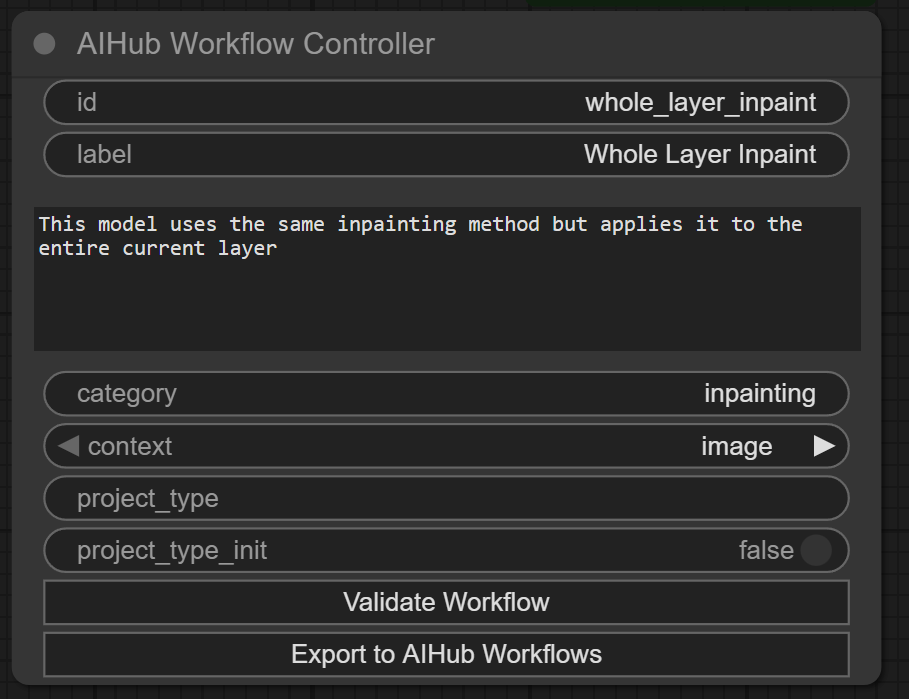

# ComfyUI-aihub-workflow-exposer
Custom nodes for ComfyUI in order to expose AI workflows to external applications (particularly image, video and audio editors) so workflows can be integrated as plugins

## Reasoning

These custom nodes were created in order to build upon a simpler way to utilize workflows from within other applications, by having "exposes", representing data which is exposed from other applications, be so an image editor, video editor or audio editor which exposes a piece of data to a workflow, the workflow is then executed by the application.

Developing exposed workflows, checkpoints and loras, is meant for advanced users; as for the purpose of this project is to enable these other applications plugins so that AI can be taught to people with less professional expertise and without access to powerful machines.

To use these custom nodes and the underlying server that extends comfyUI is highly advanced.

## Set-up basics

This custom nodes has no requeriments, because it uses what comfyUI internally uses; so copying and pasting within the custom_nodes directory should suffice.

You need the following folders within ComfyUI directory.

`ComfyUI/aihub/loras`
`ComfyUI/aihub/models`
`ComfyUI/aihub/workflows`
`ComfyUI/aihub/locale/loras`
`ComfyUI/aihub/locale/models`
`ComfyUI/aihub/locale/workflows`

## Add a lora

In order for a client to have access to a lora, it needs to be configured via a lora file, this is merely a json format file with the following information

Example file:

```json
{
    "id": "faces",
    "file": "faces.safetensors",
    "context": "image",
    "limit_to_family": "sdxl",
    "limit_to_group": "fancy_animal_model",
    "name": "Faces",
    "description": "High quality cute faces for creatures and animals",
}
```

 - id [required]: an unique identifier for the lora, preferrably should match the filename, use alphanumeric only _ and - also allowed
 - file [required]: this represents the safetensors lora file in the `ComfyUI/models/loras` directory
 - context [required]: the context that the lora applies to, image, video, text, 3d, etc... an arbitrary string is expected
 - limit_to_family [required]: limits the lora to an arbitrary string that represents a family for the model, families should be model types, for example, sdxl, flux, qwen, etc...
 - limit_to_group [optional]: limits the lora to an arbitrary group for the model, models can be grouped because they can have different versions, so it should be the name of the model without a version in it, a generic tag
 - limit_to_model [optional]: limits the lora to a specific model id
 - use_loader_model_only [optional]: this represents whether the Lora should affect the clip or not, basically by using the LoaderModelOnly class to load the lora without affecting the clip
 - description [required]: a description for the lora

You can add an image in the same directory with the id as filename, and ending in .png (representing a png image) to make that be the lora image to add as visual aid to the effect that it applies

### Add a lora by workflow

You can add a lora by using an automatic workflow method using the `AIHubMetaExportLora` node, and configuring by hand


The running the workflow will automatically export the lora to the loras folder with the given settings as json as well as the image.

The `AIHubMetaSetExportedLoraImage` can be used to set the image of the lora only.

For actions like deleting do it by hand within the filesystem, these utilities are only meant to aid and prevent mistakes while adding and not to replace manual management.

## Add a model

In order for a client to have access to a model, it needs to be configured via a model file, a json format file with the following information

Example file:

```json
{
    "id": "fancy_animal_model_v10",
    "name": "Fancy Animal Model",
    "file": "fancyAnimalModel.safetensors",
    "family": "sdxl",
    "group": "fancy_animal_model",
    "vae_file": "sdxl_vae.safetensors",
    "description": "A high-quality model for generating images of animals and creatures with intricate details and vibrant colors. Ideal for fantasy art, wildlife illustrations, and imaginative creature designs.",
    "context": "image",
    "is_diffusion_model": false,
    "default_cfg": 3.0,
    "default_steps": 20,
    "default_scheduler": "karras",
    "default_sampler": "dmpp_sde"
}
```

 - id [required]: An unique identifier for the model, preferrably should match the filename, use alphanumeric only _ and - also allowed
 - context [required]: the context that the model applies to, image, video, text, 3d, etc... an arbitrary string is expected
 - file [required]: this represents the safetensors checkpoints file in the `ComfyUI/models/checkpoints` directory or the `ComfyUI/models/diffusion_models` directory
 - family [required]: the family of the model, families should be model types, for example, sdxl, flux, qwen, etc...
 - description [required]: a description for the model
 - group [optional]: The group that the model belongs, should likely be the name of the model without its version
 - vae_file [optional]: If the checkpoint does not contain its own vae, specify the vae file here, it searches at `ComfyUI/models/vae`
 - clip_file [optional]: If the checkpoint does not contain its own clip, specify the clip file here, it searches at `ComfyUI/models/text_encoders`
 - clip_type [optional]: If the checkpoint does not contain its own clip, specify the clip type here, check the LoadClip node to see what the options are, but when adapting a workflow you should see the type there
 - is_diffusion_model [optional]: makes use of the UNETLoader which loads models from `ComfyUI/models/diffusion_models` directory instead of a checkpoint
 - default_cfg [required]: the default cfg for the model
 - default_steps [required]: the default steps for the model
 - default_scheduler [required]: the default scheduler for the model
 - default_sampler [required]: the default sampler for the model

### Add a model by workflow

You can add a model by using an automatic workflow method using the `AIHubMetaExportModel` node, and configuring it by hand


Whether the model is a diffusion model is known already simply by the model chosen, however the weight_dtype has to be set in case it is one.

Equally to the lora, an image can be chosen for the model, and the standalone node `AIHubMetaSetExportedModelImage` can be used for that.

NOTE: Exporting models (as well as the loras that apply to them) is only useful for them being selectable by `AIHubExposeModel`, as having a model exported allows them so, however if the workflow is too specific to a model or a specific set of models this is unnecessary to do so, you can load models with `AIHubUtilsLoadModel` based on say a string selection `AIHubExposeStringSelection` without them being exported, the main reason models and loras can be exported is to support workflows that simply can take any of a group or family, for example, simple image generation; and that way installing more models and loras for the same workflow is not cumbersome.

## Adapt a workflow

First any workflow to be adapted requires a AIHubWorkflowController this merely specifies the id of the workflow as well as other useful data about the workflow.

Secondly you need to add as many AIHubExpose nodes as you require to expose data from the client, there are many different types of AIHubExpose nodes for different usages and connect them with your workflow, there are many fields in the expose nodes and they will be explained later; note that you may find more expose nodes when using ComfyUI search functionality but not all has been implemented.

## Add locales

Locales are added as a folder within the specific directory of what wants to be translated, the `{id}.json` is what the file name needs to be, for example to add spanish translation to the previous model:

`ComfyUI/aihub/locale/models/es/fancy_animal_model_v10.json`

```json
{
    "name": "Modelo de Animal Fantástico",
    "description": "Un modelo de alta calidad para generar imágenes de animales y criaturas con detalles intrincados y colores vibrantes. Ideal para arte fantástico, ilustraciones de vida silvestre y diseños de criaturas imaginativas."
}
```

The same applies for loras.

For workflows it is more complicated as these are ComfyUI valid workflows, it is recommended to use the export button within the Workflow Controller as it will create a default locale for this, which can then be changed into other locales

When clients request the server with the information, they give a header over the websocket with the locale value, this is what is used for the localization, if no header is provided the information is send as it is originally defined

### AIHub Workflow Controller

The workflow controller should exist in each workflow that is exposed, and represents key data about that workflow and how it is to be used.



 - id: Represents the id of the workflow which should be unique among all workflows
 - label: A human readable label to show to the user
 - description: The description to give to the user
 - category: an arbitrary category to place the workflow at
 - context: the context for the workflow
 - project_type: allows to create aihub projects, this represents the type of the project, if a project type is specified the workflow only works with that project type; the advantage of a project is that it can store unique project files that subsequent workflows can later request, this is specially useful, for example, in step by step video generation; in LTXV for example, latent files need to be stored in order to be worked upon further, since working with images is not reasonable; within a project a latent file can be stored once specified.
 - project_type_init: a boolean that allows to specify that the workflow should "start" a new project of the given type, once that is done the project specific workflows are enabled.

Two buttons are also in there.

 - Validate Workflow: Validates the workflow to find if there are issues that would make it inoperable with the AIHub protocol.
 - Export to AIHub workflows: Validates and exports the workflow to the workflows folder so that clients can utilize it, optionally also requests for a png image that would represent the workflow.

### Standard Exposes

Expose values for the workflow, should work within any context

#### AIHub Expose Integer

The integer expose provides a single integer

 - id: Represents the id of the field which should be unique among all other fields in the same workflow
 - label: A human readable label to show to the user
 - tooltip: A tooltip about this and what it represents
 - min: The minimum value for that integer
 - max: The maximum value for that integer
 - step: The step the integer takes
 - value: The default value for that integer (also the current value)
 - advanced: Whether it represents an advanced option
 - index: Normally it is at the discretion of the client to figure how to sort the fields, use this to specify a specific ordering

#### AIHub Expose Float

The float expose provides a single floating point number

 - id: Represents the id of the field which should be unique among all other fields in the same workflow
 - label: A human readable label to show to the user
 - tooltip: A tooltip about this and what it represents
 - min: The minimum value for that floating point
 - max: The maximum value for that floating point
 - step: The step the floating point takes
 - value: The default value for that floating point (also the current value)
 - advanced: Whether it represents an advanced option
 - index: Normally it is at the discretion of the client to figure how to sort the fields, use this to specify a specific ordering
 - slider: Whether the expose should be a slider of sorts

#### AIHub Expose Boolean

The boolean expose provides a single boolean value

 - id: Represents the id of the field which should be unique among all other fields in the same workflow
 - label: A human readable label to show to the user
 - tooltip: A tooltip about this and what it represents
 - value: The default value for that boolean (also the current value)
 - advanced: Whether it represents an advanced option
 - index: Normally it is at the discretion of the client to figure how to sort the fields, use this to specify a specific ordering

#### AIHub Expose String

The string expose provides a single string value

 - id: Represents the id of the field which should be unique among all other fields in the same workflow
 - label: A human readable label to show to the user
 - tooltip: A tooltip about this and what it represents
 - minlen: the minimum length of the string value
 - maxlen: the maximum length of the string value
 - value: The default value for that boolean (also the current value)
 - multiline: Whether newlines are allowed
 - advanced: Whether it represents an advanced option
 - index: Normally it is at the discretion of the client to figure how to sort the fields, use this to specify a specific ordering

#### AIHub Expose Seed

You must have seeds exposed to the client as outside of ComfyUI WebUI the random numbers are not generated, ensure randomness of numbers by using this seed generator, it is the client responsability to provide a seed

 - id: Represents the id of the field which should be unique among all other fields in the same workflow
 - label: A human readable label to show to the user
 - tooltip: A tooltip about this and what it represents
 - value: The default value for that seed (also the current value)
 - advanced: Whether it represents an advanced option
 - index: Normally it is at the discretion of the client to figure how to sort the fields, use this to specify a specific ordering

#### AIHub Expose Steps

A steps is a simple integer greater than zero, however the main reason it has its separate expose is because it is affected by model default values, unless marked as unaffected

 - id: Represents the id of the field which should be unique among all other fields in the same workflow
 - label: A human readable label to show to the user
 - tooltip: A tooltip about this and what it represents
 - value: The default value for the steps (also the current value)
 - advanced: Whether it represents an advanced option
 - index: Normally it is at the discretion of the client to figure how to sort the fields, use this to specify a specific ordering
 - unaffected_by_model_steps: If you use a `AIHubExposeModel` the expose steps default value should change to this, the user can still change it but with this option it will force the specific steps

#### AIHub Expose Cfg

The cfg is a simple floating point value greater than zero, however the main reason it has its separate expose is because it is affected by model default values, unless marked as unaffected

 - id: Represents the id of the field which should be unique among all other fields in the same workflow
 - label: A human readable label to show to the user
 - tooltip: A tooltip about this and what it represents
 - value: The default value for the cfg (also the current value)
 - advanced: Whether it represents an advanced option
 - index: Normally it is at the discretion of the client to figure how to sort the fields, use this to specify a specific ordering
 - unaffected_by_model_cfg: If you use a `AIHubExposeModel` the expose cfg default value should change to this, the user can still change it but with this option it will force the specific cfg

#### AIHub Expose Sampler

The sampler is used for model sampling, technically a string; differences on how the different nodes treat SAMPLER values can cause issues within WebUI but not during actual execution.

 - id: Represents the id of the field which should be unique among all other fields in the same workflow
 - label: A human readable label to show to the user
 - tooltip: A tooltip about this and what it represents
 - value: The default value for the Sampler (also the current value)
 - advanced: Whether it represents an advanced option
 - index: Normally it is at the discretion of the client to figure how to sort the fields, use this to specify a specific ordering
 - unaffected_by_model_sampler: If you use a `AIHubExposeModel` the expose sampler default value should change to this, the user can still change it but with this option it will force the specific sampler

#### AIHub Expose Scheduler

The scheduler is used for model scheduling, technically a string; differences on how the different nodes treat SCHEDULER values can cause issues within WebUI but not during actual execution.

 - id: Represents the id of the field which should be unique among all other fields in the same workflow
 - label: A human readable label to show to the user
 - tooltip: A tooltip about this and what it represents
 - value: The default value for the Scheduler (also the current value)
 - advanced: Whether it represents an advanced option
 - index: Normally it is at the discretion of the client to figure how to sort the fields, use this to specify a specific ordering
 - unaffected_by_model_scheduler: If you use a `AIHubExposeModel` the expose scheduler default value should change to this, the user can still change it but with this option it will force the specific scheduler

#### AIHub Expose Image

One of the cores of AIHub is the ability to expose images from software that has been integrated, exposing an image using the default method means the image is queried from the working directory; the following options are available as inputs:

 - id: Represents the id of the field which should be unique among all other fields in the same workflow
 - label: A human readable label to show to the user
 - tooltip: A tooltip about this and what it represents
 - type: the type of the image expose
 - index: Normally it is at the discretion of the client to figure how to sort the fields, use this to specify a specific ordering

The given ouputs are given

 - image: The image in question.
 - mask: The mask of the image in question
 - pos_x: the position x of the image within the client canvas.
 - pos_y: the position y of the image within the client canvas.
 - layer_id: an id for the layer of the image within the client canvas.
 - width: width of the image
 - height: height of the image

Image Types:

 - current_layer: Provides the current layer that the user is working with, the current layer can be bigger or smaller than the canvas itself, and have any random coordinates within the canvas, current_layer provides the whole image data for that layer, pos_x and pos_y will be the position of the layer in the canvas.
 - current_layer_at_image_intersection: Provides the current layer that the user is working with but without the areas that are not visible in the canvas (pointless data since it will be invisible), normally it is better to use this when wanting the current_layer, pos_x and pos_y will be the position of this virtual layer intersection.
 - merged_image: Provides the resulting merged image of all combined layers together at the size of the canvas, excluding any information outside of the canvas, pos_x and pos_y should be zero.
 - merged_image_without_current_layer: same as merged image but excludes whatever the client considers the current selected layer, pos_x and pos_y should be zero.
 - merged_image_current_layer_intersection: it first flattens the image getting this merged image result that is the exact size of the canvas, but only provides the intersection with the current layer; so this should be exactly the same as current_layer_at_image_intersection dimension wise and position wise but the image data is all the merged layers.
 - merged_image_current_layer_intersection_without_current_layer: same as merged_image_current_layer_intersection but without the pixel data from the current layer.
 - upload: No information from the canvas, upload a new image, pos_x and pos_y are zero because it was never in a canvas.


NOTE: if you only need the information of a given image you can use the (Info Only) node, the options are exactly the same but provides the information only and not the image pixel data

#### AIHub Expose Image (Info Only)

Exactly the same as the expose image node but only provides the information

#### AIHub Expose Frame

Exposes a given frame for a video, meant to be used within frame by frame editors

 - id: Represents the id of the field which should be unique among all other fields in the same workflow
 - label: A human readable label to show to the user
 - tooltip: A tooltip about this and what it represents
 - type: the type of the image expose
 - index: Normally it is at the discretion of the client to figure how to sort the fields, use this to specify a specific ordering
 - frame_index_type: the type of the frame indexing, use to define absolute or relative positioning
 - frame_index: the given index for the video, note that you may not receive this specific index as values may be clamped

The output indexes of this node should always be positive and absolute, even if the given frame_index is a negative index

#### AIHub Expose Image Batch

The expose image batch allows to expose a series of images into an image batch tensor, as well as metadata alongside of it, it is one of the most complex nodes meant to be used from video generation, handling, and lora training.

 - id: Represents the id of the field which should be unique among all other fields in the same workflow
 - label: A human readable label to show to the user
 - tooltip: A tooltip about this and what it represents
 - type: all_frames, all_layers_at_image_size or upload; for the different possible combinations just to let the client know what it has to send, the client may decide which extra metadata to append
 - minlen: the minimum length of the batch
 - minlen_expose_id: the minimum length based on an expose id (will superseed minlen)
 - minlen_expose_expose: an offset to the minlen given by the expose
 - maxlen: the maximum length of the batch
 - maxlen_expose_id: the maximum length based on an expose id (will superseed maxlen)
 - maxlen_expose_offset: an offset to the maxlen given by the expose
 - index: Normally it is at the discretion of the client to figure how to sort the fields, use this to specify a specific ordering
 - metadata_fields: image batch can have extra metadata appended to it, the purpose is to specify extra details for example when specifying frame numbers or prompts for the specific images that are given, there is a specific way to how to specify each metadata field, following
 - metadata_fields_label: the label for the metadata fields in the same order
 - normalizer: Specify a normalizer to normalize the images in the batch, refer to `AIHubUtilsNewNormalizer`

[field_id] [TYPE] [MODIFIERS...]

 - field_id: Can be any valid json id
 - TYPE: must be either `INT` `FLOAT` `BOOLEAN` or `STRING`
 - MODIFIERS (basic): allowed are for numeric types: `SORTED`, for numeric and string: `UNIQUE`, for string: `MULTILINE`, for boolean: `ONE_FALSE` and `ONE_TRUE`
 - MODIFIERS (validators): allowed are for numeric types: `MAX:(number or expose id)` `MIN:(number or expose id) MAXOFFSET:(number) MINOFFSET:(number) DEFAULT:(number)` and for string `MAXLEN:(number or expose id)` `MINLEN:(number or expose id) MAXLENOFFSET:(number) MINLENOFFSET(number)` MAX; example `MAX:100` or `MAX:maximum_count` where `maximum_count` is the id of another property exposed that is either an integer or a project integer that is exposed, the property must be exposed

The values for the metadata will be provided as a json object in the metadata output, the metadata output can be processed by `AIHub Utils Metadata Map` in order to map one single value for data input into a string; but if more complex behaviour is required, like that on creating loras from image batches, it is expected that a custom node is to be written to handle it; since node handling is not going to cut it.

#### AIHub Expose Audio

The expose audio node allows for exposing audio from audio samplers or just as an uploaded file

 - id: Represents the id of the field which should be unique among all other fields in the same workflow
 - label: A human readable label to show to the user
 - tooltip: A tooltip about this and what it represents
 - type: the type of the audio expose
 - index: Normally it is at the discretion of the client to figure how to sort the fields, use this to specify a specific ordering

Audio Types:

 - current_segment: a segment of the audio
 - merged_audio: the entire merged audio as a whole
 - upload: upload a audio file

#### AIHub Expose Video

The expose video node allows for exposing a video from video editors or just as an uploaded file

 - id: Represents the id of the field which should be unique among all other fields in the same workflow
 - label: A human readable label to show to the user
 - tooltip: A tooltip about this and what it represents
 - type: the type of the video expose
 - index: Normally it is at the discretion of the client to figure how to sort the fields, use this to specify a specific ordering

Video Types:

 - current_segment: a segment of the video
 - merged_video: the entire video with all segments merged
 - upload: upload a video file

#### AIHub Expose Model

Allows for the client to select a model as well as apply any applicable loras (provided it is allowed)

Use of this selector is discouraged unless you want to specify an initial value, since it can be rather complicated to setup.

 - id: Represents the id of the field which should be unique among all other fields in the same workflow
 - label: A human readable label to show to the user
 - model: The model name within the checkpoints or diffusion_models folder (Default value)
 - loras: loras to load for the model, comma separated (default value)
 - loras_strengths: the strengths for the loras as a list of comma separated floating point values that must match the loras list (default value)
 - loras_use_loader_model_only: a comma separate list of t or f (True or False) for whether the loras are applied to both the clip and the model or just the model, t is for model only (default value)
 - is_diffusion_model: whether the model to load from the default value is a diffusion model from the diffusion_model folder (default value)
 - diffusion_model_weight_dtype: the diffusion model weight dtype for a diffusion model (default value)
 - limit_to_family: limit the model selection to a specific family
 - limit_to_group: limit the model selection to a specific group
 - tooltip: The tooltip for the model selector
 - advanced: whether it should be displayed as advanced options
 - index: Normally it is at the discretion of the client to figure how to sort the fields, use this to specify a specific ordering
 - disable_loras_selection: does not allow the user to select a lora
 - disable_model_selection: does not allow the user to select a model (only lora)
 - optional_vae: optional vae to use with the model instead of the checkpoint vae
 - optional_clip: optional clip to use with the model, a comma separated list of two clips can be used to specify a DualClipLoader
 - optional_clip_type: optional clip type to use with the model, applies to both clips if two have been set

If you do not need any of this advanced functionality, and you just with the user to select a model, limited to a family or group, you can use the simplified version instead (the real use of the standard version is realisticaly only to select loras for a given specific model)

This removes the advanced options and keeps only the basics

### Project Exposes

Exposes meant to only truly exist within a project, once it has been initialized; they are meant to expose a value from the client to the server without the awareness of the client as those are hidden values meant for use within the project.

Projects are composed of files that have been created by actions and simple data, how it is stored and handled it is up to the client.

The most basic case is simply a folder with a `config.json` file and another folder with the files, however it is not up to the server to determine how it is done; for instance the Gimp AIHub does timelines and allows for rollback as well as storing multiple details on the default values of exposes, but a web client can use something else instead like IndexedDB for the files or using the FileSystem API.

Project Exposes must exist within the project context, specified by the `AIHubWorkflowController` so it must not be `project_init` and it must have a `project_type`, which means an already initialized project with files within it or whatever is required for basic usage.

#### AIHub Expose Project Config Boolean

Gets the configuration value as a boolean from the project configuration file (or whatever the client uses)

 - id: Represents the id of the field which should be unique among all other fields in the same workflow
 - field: Represents the field to retrieve, use dots to access sublevels
 - default: A default value in case the field does not exist or does not have a value

#### AIHub Expose Project Config Integer

Gets the configuration value as an integer from the project configuration file (or whatever the client uses)

 - id: Represents the id of the field which should be unique among all other fields in the same workflow
 - field: Represents the field to retrieve, use dots to access sublevels
 - default: A default value in case the field does not exist or does not have a value

#### AIHub Expose Project Config Float

Gets the configuration value as a float from the project configuration file (or whatever the client uses)

 - id: Represents the id of the field which should be unique among all other fields in the same workflow
 - field: Represents the field to retrieve, use dots to access sublevels
 - default: A default value in case the field does not exist or does not have a value

#### AIHub Expose Project Config String

Gets the configuration value as a string from the project configuration file (or whatever the client uses)

 - id: Represents the id of the field which should be unique among all other fields in the same workflow
 - field: Represents the field to retrieve, use dots to access sublevels
 - default: A default value in case the field does not exist or does not have a value

#### AIHub Expose Project Text

Retrieves a file as text value

 - id: Represents the id of the field which should be unique among all other fields in the same workflow
 - file_name: the filename of the given file to be read as text

#### AIHub Expose Project Image

Retrieves a file that represents an image

 - id: Represents the id of the field which should be unique among all other fields in the same workflow
 - file_name: the filename of the given file to be read as an image file

#### AIHub Expose Project Image Batch

Retrieves an image batch (or series of images) from the project files that have been previously stored.

Use this whenever while using an action to create an image you used append, it is also possible to limit the images fetched by using indexing.

 - id: Represents the id of the field which should be unique among all other fields in the same workflow
 - file_name: Represents the file name to be loaded with the given extension
 - indexes: The indexing to retrieve, specify indexes with comma separation, use negative or positive, or specify a range
 - normalizer: Specify a normalizer to normalize the images in the batch, refer to `AIHubUtilsNewNormalizer`

#### AIHub Expose Project Audio

Retrieves a file that represents audio

 - id: Represents the id of the field which should be unique among all other fields in the same workflow
 - file_name: the filename of the given file to be read as a audio file
 - batch_index: specify an index to load a file from a batch, the index can be negative just like python indexes

#### AIHub Expose Project Video

Retrieves a file that represents a video that must be loaded, the expose project video function cannot load a video file and it must be done by another node

 - id: Represents the id of the field which should be unique among all other fields in the same workflow
 - file_name: the filename of the given file to be read as a video file
 - batch_index: specify an index to load a file from a batch, the index can be negative just like python indexes

#### AIHub Expose Project Latent

Retrieves a file that represents a torch latent tensor representation

 - id: Represents the id of the field which should be unique among all other fields in the same workflow
 - file_name: the filename of the given file to be read as a latent file
 - batch_index: specify an index to load a file from a batch, the index can be negative just like python indexes

### Actions

Actions are executed to provide output to the client

If an action occurs within a project that file is meant to be stored within the project boundaries and should be able to be retrieved later

#### AIHub Action New Text

Provides a new text file to the client

 - text: the text that such file contains
 - action: The file action to execute, `APPEND` will create a text file batch, while `REPLACE` will replace a single existing file or create it if it doesn't exist
 - name: the name of the new file
 - mime_type: the mime type of the file
 - file_name: use this filename with the extension included for the actual filename of the file as it will be stored, (optional)

#### AIHub Action New Image

Provides a new image to the client

 - image: the image to export
 - action: The file action to execute, `APPEND` will create a text file batch, while `REPLACE` will replace a single existing file or create it if it doesn't exist
 - name: the name of the new file
 - file_name: use this filename with the extension included for the actual filename of the file as it will be stored, it must be png (optional)
 - mask: use this to provide a mask for the image giving it an alpha channel (optional)

#### AIHub Action New Layer

Provides a new image layer to the client

 - image: the image to export
 - pos_x: the position x of the new layer in the canvas
 - pos_y: the position y of the new layer in the canvas
 - reference_layer_id: the id of the reference layer to insert the layer at
 - reference_layer_action: The action to use to insert that layer at, available actions are `REPLACE`, `NEW_BEFORE` and `NEW_AFTER`
 - name: the name of the new layer
 - action: The file action to execute, `APPEND` will create a text file batch, while `REPLACE` will replace a single existing file or create it if it doesn't exist, this is a filesystem level action, since Layers are supposed to be integrated within the project, REPLACE is often the right option here as the client may decide to delete the file it used later
 - file_name: use this filename with the extension included for the actual filename of the file as it will be stored, it must be png (optional)
 - mask: use this to provide a mask for the image giving it an alpha channel (optional)

#### AIHub Action New Image Batch

Provides new images to the client

This is achieved by calling Action New Image many times in APPEND mode, so it is equivalent to a loop in there.

 - images: the images to export as batch in the given order
 - masks: optional masks for the images to give them an alpha channel
 - name: name of the image batch
 - file_name: file name for the image batch, a number will be added, just specify a simple file name the client will handle the batching on multiple files
 - action: `APPEND` or `REPLACE`, if append is used, the batch will concatenate to an existing batch, if replace is used the batch will replace an existing batch.

#### AIHub Action New Frames

Provides frames to the client, basically the same as an image batch action but with an extra action at the end meant to be used within a video

 - images: the images to export as batch in the given order
 - name: name of the image batch
 - file_name: file name for the image batch, a number will be added, just specify a simple file name the client will handle the batching on multiple files
 - action: `APPEND` or `REPLACE`, if append is used, the batch will concatenate to an existing batch, if replace is used the batch will replace an existing batch.
 - insert_index: the number a pythonic style index (negative allowed) where to insert the given batch at
 - insert_action: the action to do `APPEND` or `REPLACE` regarding the video

#### AIHub Action New Audio

Provides new audio to the client

 - audio: the audio to be provided to the client
 - action: The file action to execute, `APPEND` will create a text file batch, while `REPLACE` will replace a single existing file or create it if it doesn't exist
 - name: the name of the audio file
 - format: the format to be exported at
 - file_name: an optional filename with the given extension

#### AIHub Action New Audio Segment

Provides new audio segment to the client

 - audio: the audio to be provided to the client
 - action: The file action to execute, `APPEND` will create a text file batch, while `REPLACE` will replace a single existing file or create it if it doesn't exist
 - reference_segment_id: the segment id to have as a reference for inserting this segment
 - reference_segment_action: the action to execute over that segment, `NEW_AFTER`, `NEW_BEFORE`, `MERGE` and `REPLACE`
 - name: the name of the audio file
 - format: the format to be exported at
 - file_name: an optional filename with the given extension

#### AIHub Action New Video

Provides new video to the client

 - video: the video to send to the user
 - action: The file action to execute, `APPEND` will create a text file batch, while `REPLACE` will replace a single existing file or create it if it doesn't exist
 - name: the name of the new file
 - file_name: use this filename with the extension included for the actual filename of the file as it will be stored, (optional)
 - format: the format of the video
 - codec: the codec for the video
 - crf: crf compression

#### AIHub Action New Video Segment

Provides new video segment to the client

 - video: the video to send to the user
 - action: The file action to execute, `APPEND` will create a text file batch, while `REPLACE` will replace a single existing file or create it if it doesn't exist
 - reference_segment_id: the segment id to have as a reference for inserting this segment
 - reference_segment_action: the action to execute over that segment, `NEW_AFTER`, `NEW_BEFORE` and `REPLACE`
 - name: the name of the new file
 - file_name: use this filename with the extension included for the actual filename of the file as it will be stored, (optional)
 - format: the format of the video
 - codec: the codec for the video
 - crf: crf compression

#### AIHub Action Set Project Config Boolean

Sets the configuration boolean of a given project at its project config file

 - field: the filed id, use dots for entering sublevels
 - value: the value to set at

#### AIHub Action Set Project Config Integer

Sets the configuration integer of a given project at its project config file

 - field: the filed id, use dots for entering sublevels
 - value: the value to set at

#### AIHub Action Set Project Config Float

Sets the configuration float of a given project at its project config file

 - field: the filed id, use dots for entering sublevels
 - value: the value to set at

#### AIHub Action Set Project Config String

Sets the configuration string of a given project at its project config file

 - field: the filed id, use dots for entering sublevels
 - value: the value to set at

### Validation

#### AIHub Add Run Condition

Adds a condition for the run to execute

 - condition: the condition to run, can use expose ids and attributes of them, it can only do very basic operations
 - error: the error to show the client if the condition does not succeed

### Utilities

#### AIHub Utils Crop Merged Image To Layer Size

Crops the merged image to a given layer size, provided the layer known coordinates; this is used as a fallback node for image programs that may not be capable of providing `merged_image_current_layer_intersection_without_current_layer` or `merged_image_current_layer_intersection`

 - image: the merged layer image
 - mask: the merged layer mask (optional)
 - layer_pos_x: layer position x
 - layer_pos_y: layer position y
 - layer_width: layer width
 - layer_height: layer height

This will provide a new cropped merged image

#### AIHub Utils Fit Layer To Merged Image

Crops the current_layer to fit the merged image avoiding overflows; this is used as a fallback node for image programs that may not be capable of providing `current_layer_at_image_intersection`

 - layer_image: the image of the layer
 - layer_mask: the mask of the layer (optional)
 - merged_image_width: the merged image width
 - merged_image_height: the merged image height

It will output a new image, mask, new position x and y, as well as new width and height; this would be equivalent to if `current_layer_at_image_intersection` was given but from the current layer.

#### AIHub Utils Float To Int

Takes a float value and casts it into an integer

#### AIHub Utils Str To Float

Takes a string value and casts it into a float

#### AIHub Utils Str To Vector

Takes a string value and casts it into a float vector of 3 values at least

An example usage how to use these utils, here we make a selector that allows us to choose the resolution of our video based on landscape and portrait in a string selector


#### AIHub Utils Load VAE

This is used to load a VAE, it works accross workflows and will keep the VAE in memory

The reason it exists as a separate utility is that it takes a string as the input, ensuring that you can dinamically load this from stored files or exposes, or so on.

#### AIHub Utils Load Lora

This is used to load a Lora, it works accross workflows and will keep the Lora in memory

The reason it exists as a separate utility is that it takes a string as the input, ensuring that you can dinamically load this from stored files or exposes, or so on.

#### AIHub Utils Load Model

This is used to load a Model, it works accross workflows and will keep the Model in memory

The reason it exists as a separate utility is that it takes a string as the input, ensuring that you can dinamically load this from stored files or exposes, or so on.

 - model: the model to load.
 - is_diffusion_model: whether the model is a diffusion model and must use the UNETLoader
 - diffusion_model_weight_dtype: the weight dtype of a diffusion model when diffusion model is true

It gives everything that a checkpoint loader does however it will not give clip or vae for diffussion models

#### AIHub Utils Load CLIP

The reason it exists as a separate utility is that it takes a string as the input, ensuring that you can dinamically load this from stored files or exposes, or so on.

This is used to load a Clip, it works accross workflows and will keep the Lora in memory

 - clip_1: the first clip to load
 - clip_2: the second clip to load (optional)
 - type: type of the clip
 - device: the device for the clip

#### AIHub Utils Metadata Map

Use this to map values from the metadata obtained from image batches into string values to be used in inputs.

For example, the LTXV image sampler needs to receive the indexes of each frame as comma separated

We turn it into eg. "0,48,97" 


#### AIHub Utils New Normalizer

Creates a normalizer object that is used in image batches to normalize the images of the exposed values before they are transformed into a tensor

 - normalize_at_width: the width of the normalization of images, if zero is provided here, alongside the height, the normalizer will seek for the image with most megapixels
 - normalize_at_height: the height of the normalization of images, if zero is provided here, alongside the height, the normalizer will seek for the image with most megapixels
 - normalize_upscale_method: the upscale method to use during normalization

It provides a normalizer object as output

#### AIHub Utils Scale Image And Masks

It basically allows to use a normalizer to normalize image and mask, however it will only work in already existing tensors and processed images as it is for used within workflows, not preprocessing

In practise this is basically just an upscaler/downscaler, just that it also works with masks; if masks are not required the simple method of using image scale by shall work best.

 - images: the images to normalize
 - masks: the masks to normalize
 - normalize_at_width: the width of the normalization of images
 - normalize_at_height: the height of the normalization of images
 - normalize_upscale_method: the upscale method to use during normalization

### Exporting the workflow

You need to enable export as API in comfyUI to export the workflow in API format and save it into the `aihub/workflows` folder

An image with the same id as the workflow id as specified in the AIHubWorkflowController node and ending in png will serve as the image for the given workflow.


You can use the buttons export and validate to export the workflow to the given folder

## Environment Variables

### AIHUB_COLD

Normally workflows, loras, and models are "hot" by default which means they are requested as they are in the filesystem at that moment, `AIHUB_COLD=1` will make sure that they are instead cached in memory.

Default `0`

### AIHUB_DIR

Normally existing at the `ComfyUI/aihub` directory of the comfyui installation, it can be changed

### AIHUB_PERSIST_TEMPFILES

Temporary files of what the user has send via the websocket are by default removed per connection, leaving no trace, if you have a setting where you need to review the files that users have uploaded to the server for [insert anti-privacy reason here] you can do that with `AIHUB_PERSIST_TEMPFILES=1`

Default `0`

### AIHUB_TEMP_DIR

Default `(the os temporary directory)`

The temporary directory to use to store the temporary files that the client created

### AIHUB_MAX_MESSAGE_SIZE

The max message size for the aihub websocket

Defaults to 50MB